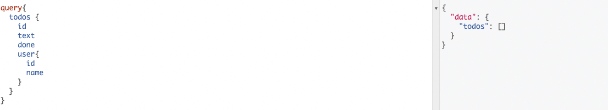
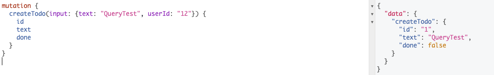
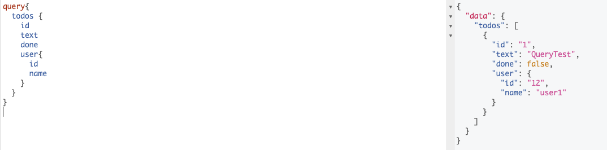

# Sample Query

  
## Query


<p align="center">
  

</p>

## Mutation


<p align="center">
    

</p>


## newQuery


<p align="center">
   

</p>

#
## Run

```
go run ./server.go //Server Started

localhost:8080 //Browser
```


#### Thank you acklackl 
